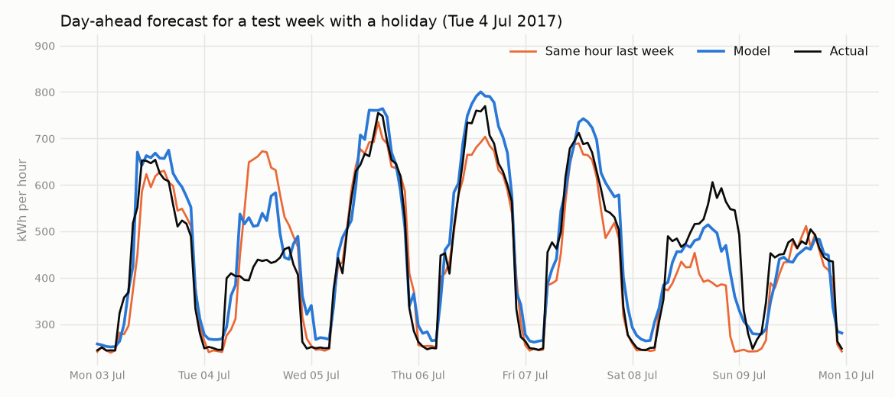
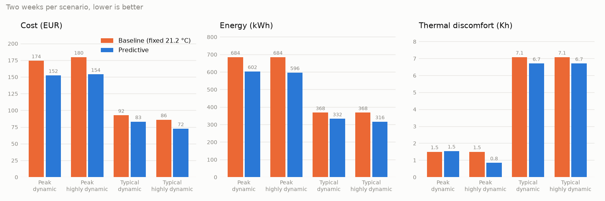

# edge-energy-optimizer

Forecast a building's energy load, use the forecast to control the building, and cut its peak demand, all running on a small edge cluster.

## Purpose

Buildings pay for electricity in two ways: the total energy they use (kWh) and the highest power they draw at any moment (peak demand, kW). The peak charge can be a large share of the bill, so flattening peaks saves real money without making anyone uncomfortable.

This project builds the full chain needed to do that:

1. Predict how much power the building will need over the next hours.
2. Decide what the heating, cooling, and battery should do about it.
3. Talk to building equipment using the protocols real equipment speaks.
4. Run the whole thing on edge hardware, close to the building, not in the cloud.

Everything runs against simulators, so you need no physical building, meter, or battery to work on it.

## Status

Phases 1 (load forecasting) and 2 (control against a simulated building) are complete. Phase 3 is next.

## Phase 1 results

The forecaster predicts each hour of the next day for one real office building (`Hog_office_Shawnna` from the [Building Data Genome Project 2](https://github.com/buds-lab/building-data-genome-project-2)). It is trained on 2016 and scored on all of 2017, which it never saw.

| Forecast | MAE on 2017 | Share of average load |
| --- | --- | --- |
| Same hour yesterday | 59.5 kWh | 15.0% |
| Same hour last week | 45.7 kWh | 11.5% |
| **Model (gradient boosted trees)** | **34.5 kWh** | **8.7%** |

The model's error is 24.5% lower than the best naive baseline.



Known limits:

- **It guesses high.** Average error is +13.8 kWh, because the building used about 8% less in 2017 than in the training year. Regular retraining would be needed in live use.
- **Holidays are the weak spot.** MAE on holidays is 61.9 kWh, against 32.6 on normal weekdays. One training year has too few holidays to learn from.
- **Weather is measured, not forecast.** A live system would use weather forecasts, which are less accurate, so real errors would be somewhat higher.

## Phase 2 results

A predictive controller heats a simulated family home (BOPTEST test case `bestest_hydronic_heat_pump`). It looks 24 hours ahead, stops heating while the home is empty, reheats before people return, and stores heat when electricity is cheap. The baseline is a thermostat fixed at 21.2 °C. Each run covers two weeks.

| Scenario | Cost, baseline | Cost, predictive | Saved | Discomfort, baseline | Discomfort, predictive |
| --- | --- | --- | --- | --- | --- |
| Coldest period, day/night tariff | 174.16 EUR | 152.23 EUR | 12.6% | 1.49 Kh | 1.53 Kh |
| Coldest period, spot prices | 179.56 EUR | 153.83 EUR | 14.3% | 1.49 Kh | 0.84 Kh |
| Typical period, day/night tariff | 92.49 EUR | 82.95 EUR | 10.3% | 7.08 Kh | 6.70 Kh |
| Typical period, spot prices | 85.81 EUR | 72.44 EUR | 15.6% | 7.08 Kh | 6.71 Kh |



Most of the saving comes from not heating an empty home, and the settings were tuned on these same scenarios. The full summary and its limits are in [docs/results/phase2.md](docs/results/phase2.md).

## Running phase 1

```bash
uv run python scripts/download_data.py
```

That downloads about 195 MB into `data/raw/`. Then each step can be run on its own:

| Command | What it does |
| --- | --- |
| `uv run python -m edge_energy_optimizer.forecasting.explore` | Charts the load patterns |
| `uv run python -m edge_energy_optimizer.forecasting.baseline` | Scores the naive baselines |
| `uv run python -m edge_energy_optimizer.forecasting.model` | Trains and saves the model |
| `uv run python -m edge_energy_optimizer.forecasting.evaluate` | Scores the model against the baselines |
| `uv run python -m edge_energy_optimizer.forecasting.analyze` | Breaks the errors down by month and day type |
| `uv run python -m edge_energy_optimizer.forecasting.forecast` | Forecasts one example day |
| `uv run pytest` | Runs the tests (no download needed) |

Other code gets a forecast by calling `forecast()` in `src/edge_energy_optimizer/forecasting/forecast.py`.

## Running phase 2

Phase 2 needs BOPTEST running locally. Start Docker Desktop, then get BOPTEST once:

```bash
git clone --depth 1 --branch v0.9.0 https://github.com/ibpsa/project1-boptest.git external/boptest
```

Start it from the repo root. The first start builds the images and takes several minutes:

```bash
docker compose --project-directory external/boptest -f external/boptest/docker-compose.yml -f docker/boptest.override.yml up -d web worker provision
```

BOPTEST then answers on `http://127.0.0.1:80`. The override file swaps the MinIO images BOPTEST pins, which no longer exist on Docker Hub (see [decision 0003](docs/decisions/0003-control-strategy.md)).

| Command | What it does |
| --- | --- |
| `uv run python -m edge_energy_optimizer.control.experiment` | Runs both controllers on all four scenarios (about 3 minutes) and saves the results |
| `uv run python -m edge_energy_optimizer.control.report` | Draws the charts from the saved results |

Stop BOPTEST when done:

```bash
docker compose --project-directory external/boptest -f external/boptest/docker-compose.yml -f docker/boptest.override.yml down
```

A new control strategy is a class with a `setpoint_c(observation, forecast)` method, added to `CONTROLLERS` in `src/edge_energy_optimizer/control/experiment.py`. See `src/edge_energy_optimizer/control/base.py`.

## Setup

You need:

- [Git](https://git-scm.com/)
- [uv](https://docs.astral.sh/uv/getting-started/installation/), which manages both the Python version and the dependencies
- [Docker](https://docs.docker.com/get-docker/), needed from phase 2 onward to run the BOPTEST building simulator

Then:

```bash
git clone <repo-url>
cd edge-energy-optimizer
uv sync
```

`uv sync` reads `pyproject.toml`, installs the Python version pinned in `.python-version`, and creates a virtual environment in `.venv/`. You do not need to activate it. Prefix commands with `uv run` instead:

```bash
uv run python --version
```

### Working with dependencies

| Task | Command |
| --- | --- |
| Add a runtime dependency | `uv add <package>` |
| Add a dev-only dependency | `uv add --dev <package>` |
| Remove a dependency | `uv remove <package>` |
| Sync after pulling changes | `uv sync` |

Always commit `pyproject.toml` and `uv.lock` together. Never edit `uv.lock` by hand and never use `pip install` in this repo.

## Phase roadmap

| Phase | What gets built | Target |
| --- | --- | --- |
| 1 | Energy load forecasting (ML) | Done |
| 2 | Control logic tested against a simulated building (BOPTEST) | Done |
| 3 | BACnet and Modbus protocol integration | TBD |
| 4 | Peak demand shaving with a simulated battery | TBD |
| 5 | Edge deployment on k3s with MQTT and a dashboard | TBD |

Each phase builds on the one before it and should leave the repo in a working, demonstrable state. See [docs/architecture.md](docs/architecture.md) for how the phases fit together.

## Repository layout

```
edge-energy-optimizer/
├── docs/
│   ├── architecture.md   # the 5-phase vision and how the parts connect
│   ├── decisions/        # architecture decision records (ADRs)
│   ├── results/          # result summaries and KPI tables
│   └── img/              # charts produced by the code
├── docker/               # compose override for running BOPTEST
├── external/             # BOPTEST checkout (not committed)
├── scripts/
│   └── download_data.py  # fetches the dataset into data/raw/
├── src/edge_energy_optimizer/
│   ├── forecasting/      # phase 1: dataset, features, model, evaluation
│   └── control/          # phase 2: controllers, BOPTEST client, experiments
├── tests/
├── pyproject.toml        # project metadata and dependencies
├── .python-version       # Python version uv installs
└── README.md
```

`data/`, `models/`, and `external/` are created locally and are not committed.

## Glossary

- **Load forecasting**: predicting future power demand from history, weather, and calendar features.
- **BOPTEST**: an open source framework that runs a physics-based building model in Docker and exposes it over a REST API, so control strategies can be tested and scored fairly.
- **Setback**: letting the temperature drift while a building is empty, to save energy.
- **MPC (model predictive control)**: control that uses a model of the building to simulate and optimize a plan, then re-plans every step.
- **BACnet**: the standard protocol for building automation equipment such as HVAC controllers.
- **Modbus**: a simple, older protocol common on meters, inverters, and batteries.
- **Peak shaving**: discharging a battery (or reducing load) when demand is high so the grid sees a flatter profile.
- **k3s**: a lightweight Kubernetes distribution made for edge devices.
- **MQTT**: a lightweight publish/subscribe messaging protocol common in IoT.

## Contributing

- Read [docs/architecture.md](docs/architecture.md) before your first change.
- Work on a branch and open a pull request. Keep each one small and focused on a single phase.
- When you make a choice that would be hard to reverse (a library, a protocol, a data format), record it as a new file in [docs/decisions/](docs/decisions/), following the format of the existing ones.
