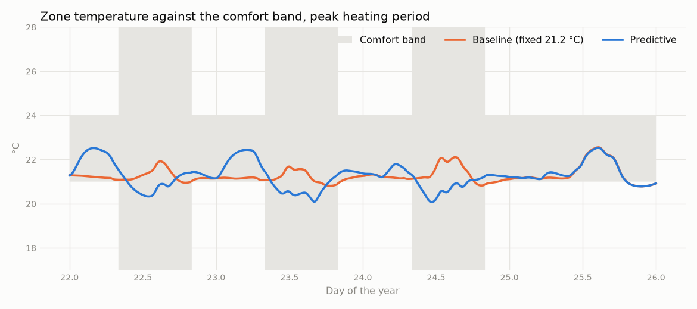
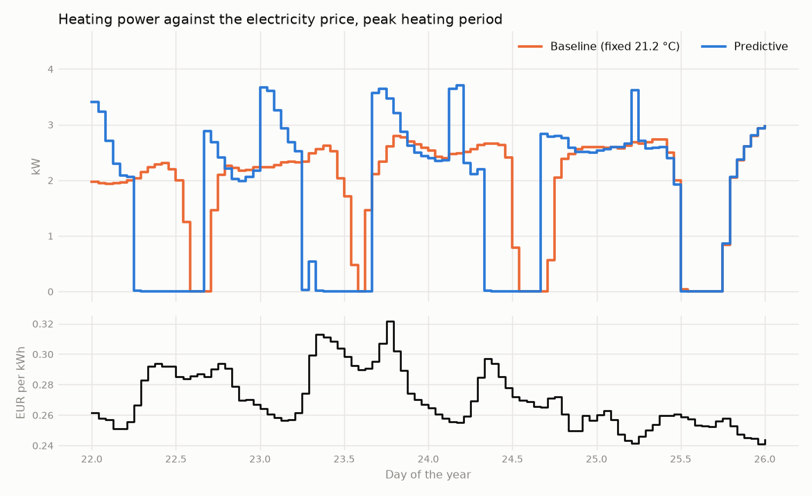

# Phase 2 results: predictive heating control

## Headline

**The predictive controller cut heating cost by 10% to 16% in every scenario tested, with comfort no worse than the baseline.**

## What was tested

A simulated 192 m² family home in Brussels, heated by a heat pump and underfloor heating. The home is empty on weekdays from 07:00 to 20:00. The simulator is [BOPTEST](https://ibpsa.github.io/project1-boptest/) (test case `bestest_hydronic_heat_pump`, version 0.9.0), which scores every controller the same way.

| | Baseline | Predictive |
| --- | --- | --- |
| Strategy | Thermostat fixed at 21.2 °C all day | Looks 24 hours ahead at occupancy, price, and weather |
| When the home is empty | Keeps heating | Lets the temperature drift down |
| Before people return | Nothing to do | Starts reheating 4 hours ahead |
| When electricity is cheap | Ignores price | Stores 1 °C of extra heat in the floor, except on mild days |

Each controller ran for two weeks in four scenarios: the coldest period of the year and a typical spring period, each under a day/night tariff and under hourly spot prices.

## Results

| Scenario | Cost, baseline | Cost, predictive | Cost saved | Energy saved | Discomfort, baseline | Discomfort, predictive |
| --- | --- | --- | --- | --- | --- | --- |
| Coldest period, day/night tariff | 174.16 EUR | 152.23 EUR | **12.6%** | 12.0% | 1.49 Kh | 1.53 Kh |
| Coldest period, spot prices | 179.56 EUR | 153.83 EUR | **14.3%** | 12.9% | 1.49 Kh | 0.84 Kh |
| Typical period, day/night tariff | 92.49 EUR | 82.95 EUR | **10.3%** | 9.6% | 7.08 Kh | 6.70 Kh |
| Typical period, spot prices | 85.81 EUR | 72.44 EUR | **15.6%** | 14.1% | 7.08 Kh | 6.71 Kh |

Discomfort is measured in kelvin-hours (Kh): how far the temperature was outside the comfort band, multiplied by how long. Lower is better, and 1.5 Kh over two weeks is about a tenth of a degree for 15 hours.


## How it saves money

The predictive controller stops heating while the home is empty and catches up before people return. The temperature stays inside the comfort band (grey) whenever someone is home.



Under spot prices it also buys more of its heat in the cheaper hours.



Where the saving comes from, under spot prices:

| | Coldest period | Typical period |
| --- | --- | --- |
| Not heating an empty home | 12.7% | 10.2% |
| Buying heat in cheap hours | 1.6% more | 5.4% more |
| Total | 14.3% | 15.6% |

## What to keep in mind

- **Most of the saving is from not heating an empty home.** Price awareness adds 2 to 5 points. About 0.20 EUR of every kWh is fixed taxes and network fees, so the price a home pays moves far less than the wholesale price underneath it.
- **The price rule does nothing under the day/night tariff.** It looks for the cheapest quarter of the day, and the night rate covers more than a quarter, so no hour stands out. A variant that reacts to any below-average price was tried. It helped under the day/night tariff and hurt under spot prices, for the same total cost, so it was not adopted.
- **Peak power is higher**: 3.9 kW against 3.1 kW in the coldest period, because reheating runs the heat pump hard. This tariff has no peak charge. Where one applies, it would eat into the saving. Phase 4 addresses peaks.
- **The baseline is not perfectly comfortable either.** Its discomfort in the typical period is almost all overheating on sunny days, which no heating controller can prevent in a home with no cooling.
- **The settings were tuned on these same scenarios.** The 10 °C mild-day threshold was chosen after seeing the first results. Expect somewhat smaller savings on weeks the controller has not seen.
- **Forecasts were perfect.** BOPTEST supplied exact weather, prices, and occupancy. Real forecasts are less accurate.
- **One simulated home.** A home that is occupied all day would save much less, because there would be no empty hours to exploit.

## Reproduce

Start BOPTEST as described in the [README](../../README.md), then:

```bash
uv run python -m edge_energy_optimizer.control.experiment
uv run python -m edge_energy_optimizer.control.report
```

The numbers above are in [phase2_kpis.csv](phase2_kpis.csv).
